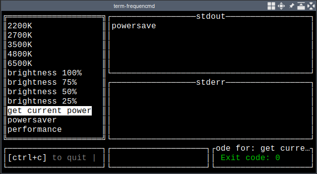
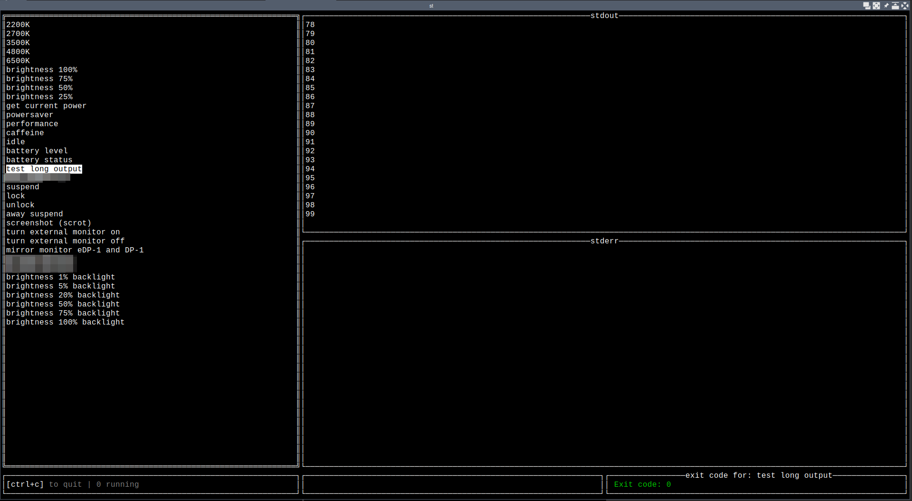

# frequencmd

TUI app that can run any shell commands you want. Like bookmarks in your web browser, except shell commands.

## Screenshots





## Motivation

I run a lot of commands frequently and wanted to have an easy way to run them. They're not complex - they'll do things like setting the current screen brightness, or change the current powersaver mode. A TUI-based application that could do this for me proved very useful, as it could be used regardless of whether I have an x11/wayland display server running or if I'm in a tty.

## Features

- `/` key to fuzzy find items in the left pane (`/` key again to clear search)
- multiple commands can be run simultaneously
- stderr and stdout are separated
- everything else should be intuitive & simple

## Disclaimer

This application may be buggy. It is not battle-tested except for within my own use cases, which have been successful for about a month as of writing this. It may not do what you expect. You've been warned!

## Usage

Download the appropriate version from the releases page according to your OS. Note that not all systems have been tested at this point in time.

**Important: Mac users need to un `unxz frequencmd-*.xz` first.** Builds for Macs are compressed using `xz` because the build process uses `upx` to compress binaries for all platforms, which does not support Mac OS.

Then, copy `config.example.yml` to `~/.config/frequencmd/config.yml` and modify it to your needs. You may need to create the parent directory.

## Building locally

Requires Go. It is a very lean application and should be easy to get running. You can install it via `go install`:

```bash
CGO_ENABLED=0 go install -ldflags="-s -w" github.com/charles-m-knox/frequencmd@latest
```

Just make sure you have configured your `$PATH` environment variable to include your go bin directory.

## Configuration

The application will first attempt to read from the first file it finds at the following locations:

1. `./config.yml`, then
2. `$XDG_CONFIG_HOME/frequencmd/config.yml`, then
3. `$HOME/frequencmd/config.yml`.

The configuration is a simple `yml` file and currently looks like:

```yaml
---
idleRefreshRateMs: 500
processRunningRefreshRateMs: 100

commands:
  - label: "2200K"
    command: "redshift"
    args: "-P -O 2200"
    env:
      - "DISPLAY=:0"

  - label: "4800K"
    command: "redshift"
    args: "-P -O 4800"
    env:
      - "DISPLAY=:0"

  - label: "6500K"
    command: "redshift"
    args: "-P -O 6500"
    env:
      - "DISPLAY=:0"

  - label: "brightness 100%"
    command: "/bin/bash"
    shell: "xrandr --output eDP-1 --brightness 1"
    env:
      - "DISPLAY=:0"

# ...
```

## Roadmap

There's not much left to do on this application aside from polishing and refactoring to clean up the codebase. It was hacked together pretty quickly and really doesn't need to do anything more than what it already does. However, it would be neat to have configurable colors translation strings, but currently I'm making no public commitment to that end.

## Compilation targets

Run `make build-all` to build for Linux amd64 & arm, Mac amd64 & arm, and Windows amd64 at the same time. It may take a short while to build for all platform targets. The `xz` command used may require ~14GB of RAM - to change this, modify the `xz -9` flag in `Makefile` to something like `-6`, or just get rid of the extra performance flags entirely.

## License

This software is licensed as AGPL3 or later, see [`LICENSE`](/LICENSE).
